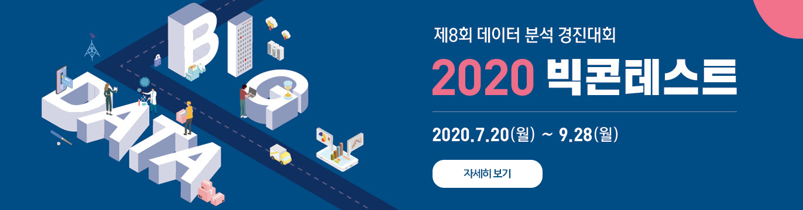
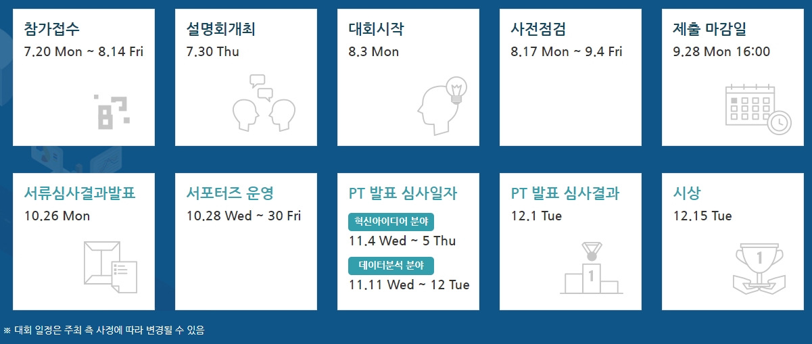
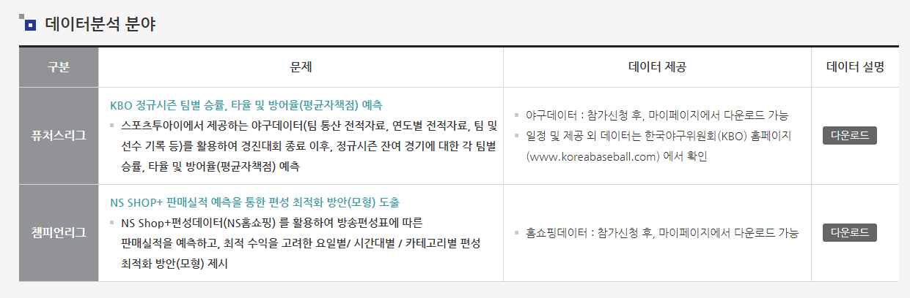
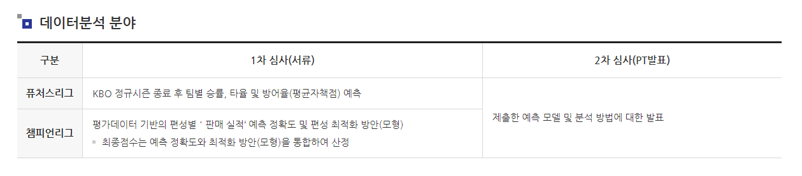
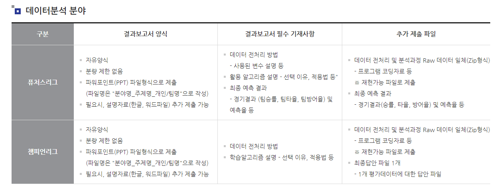
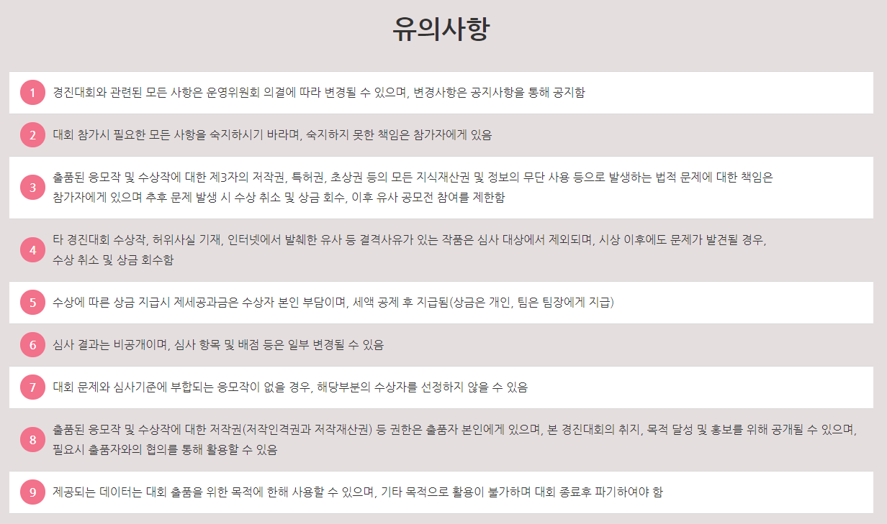

# **TEAM KUAI** 2020 빅콘테스트 챔피언스 리그 

## 대회요강

### 참가자격
- 전국 대학(원)생(휴학생포함) 및 일반인
    - 대회 시작일(8.3) 기준, 대학(원)생은 나이제한 없음
    - 데이터 분석 및 컨설팅 업체 소속 임직원은 참여 불가

### 대회일정

### 대회 문제

### 평가방법

### 결과제출

1. 마이페이지 내 결과제출바로가기 에서 제출(파일 용량 초과시, 사무국 이메일/웹하드로 제출하며 별도 안내 예정)
2. 결과보고서 양식 및 추가 제출파일
    - 심사진행과정에서 추가로 자료를 요청할 수 있음
    - 결과보고서 필수 포함내용 미기재 및 추가 제출파일 미제출시, 심사 및 수상에서 제외 될 수 있음
    

### 유의사항

